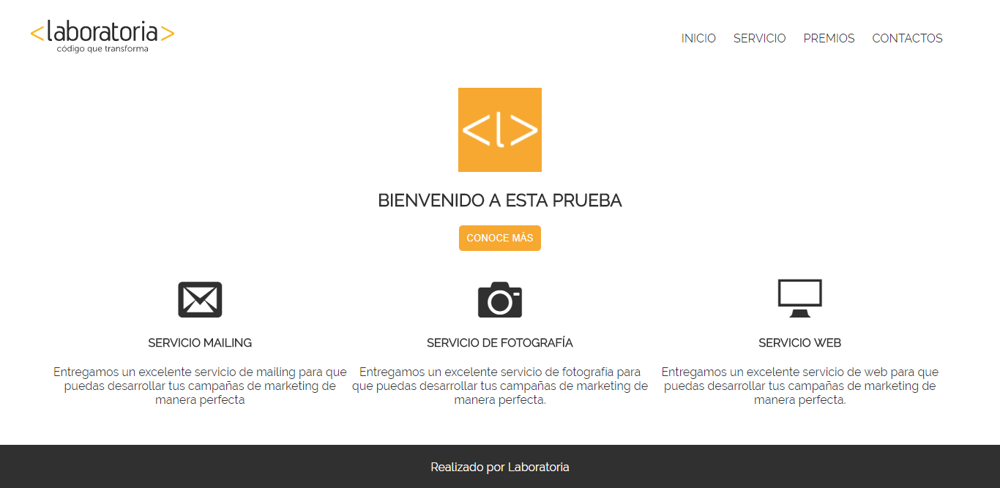

## Proyecto: Seminar-css.
## Programa: Practicar herencia en css.

**Descripción del proyecto:**
* Aplicar lo aprendido en esta clase práctica.

**Herramientas utilizadas:**
* HTML y CSS.

**Objetivo del proyecto**

